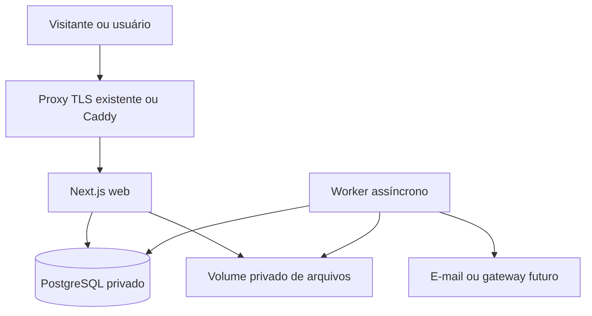

# Implantação e operação na VPS

Este runbook não executa instalação. O usuário não informou especificação da VPS ou o que já roda nela. Claude deve primeiro coletar inventário remoto usando acesso SSH já configurado; não pedir segredos por chat nem imprimir valores de `.env`. Nunca substituir serviços do servidor por suposição.

## Arquitetura alvo

Serviços públicos: somente 80/443 e SSH já protegido. PostgreSQL/worker ficam em rede Docker interna. Volumes persistentes nomeados e paths de backup fora do web root. Caddy automático somente se não houver proxy atual; se há Nginx, Traefik ou painel da hospedagem, criar integração testável com ele. TLS e DNS validados.

## Requisitos de entrada

Hostname e DNS, certificado, SO suportado, arquitetura AMD64/ARM64, Docker/Compose, RAM/CPU/disco, portas, proxy atual, acesso SSH não-root, firewall, banco/volumes já existentes, rotina de backup e destino externo. Verificar folga para build/migração e plano de recuperação. Se VPS não comporta banco + app + worker com margem, recomendar arquitetura menor ou servidor de banco gerenciado com base em dados medidos.

## Configuração e segredos

`.env.example` contém nomes sem valores reais. `.env.production` criado remotamente com permissão 0600; nunca commitado, embutido na imagem, impresso em log ou posto no pacote. Incluir DATABASE_URL (host interno), AUTH_SECRET gerado no servidor, APP_URL, storage, SMTP, callback URLs e webhook secrets quando escolhidos. Segredos externos vêm do usuário no ambiente de deployment, nunca de exemplo.

Usar usuário Linux dedicado, grupo Docker restrito, firewall, atualizações de segurança, SSH por chave já configurado, monitoramento de disco e limitação de recursos. Acesso Docker equivale a root, então restringi-lo. Serviço de banco sem porta publicada, TLS na borda, cabeçalhos e cookie Secure. Nenhuma integração de pagamento real ligada no primeiro piloto sem credenciais/sandbox verificadas.

## Compose de produção

Criar `compose.yaml` com `web`, `worker`, `db` e `proxy` opcional, `healthcheck`, `restart: unless-stopped`, rede interna e volumes. `db` não pode escutar na Internet. `web`/`worker` executam como non-root; logs com rotação; build multi-stage, lockfile frozen, runtime enxuto, versão fixada por digest. Migrations executam como job de release de uma só vez, antes de `web` trocar. App deve iniciar readiness apenas depois de schema compatível.

## Release e rollback

1. CI executa lint/typecheck/test/build, verifica migração e scans de dependências/secrets.
2. Criar imagem versionada por SHA imutável. Nunca sobrescrever `latest` como fonte de release.
3. No alvo: verificar domínio, espaço, serviço atual e estado do backup; registrar versão vigente.
4. Gerar backup sob demanda e confirmar arquivo + teste de leitura. Aplicar migrations aditivas compatíveis antes do novo código.
5. Subir worker/web e esperar health/readiness; verificar `/healthz`, `/readyz`, login de teste, venda fake e métricas com dados de teste segregados.
6. Trocar rota do proxy de forma atômica quando possível; validar TLS, cookies, assets, logs e tráfego.
7. Reverter app para imagem anterior se saúde falhar. Migração deve ser compatível; migrations destrutivas/transformações irreversíveis exigem janela e estratégia de expansão/contração própria.
8. Se dados já foram mutados por código incompatível, não fingir rollback de container resolve: preservar estado, parar escrita e restaurar com procedimento explícito testado.

Nunca executar `docker compose down -v`, `prisma migrate reset`, `DROP`, truncate ou restore sobre banco vivo sem plano aprovado, manutenção e backup verificado. Não rodar `docker system prune --volumes`.

## Backup e restauração

PostgreSQL: `pg_dump` custom format por versão compatível, compressão, criptografia antes do envio, destino fora da VPS, retenção diária/semana/mês configurada, acesso limitado, checksum e notificação de falha. Para base pequena, backup lógico; para crescer, avaliar WAL/PITR. Arquivos: snapshot/rsync versionado criptografado com consistência coordenada; banco + arquivos precisam de estratégia temporal comum. Guardar código, migrations, manifestos sem segredos e instruções de recuperação.

Frequência inicial proposta: diário, RPO 24 h, retenção 14 diárias/8 semanais/6 mensais, a ajustar ao piloto; PITR e RPO menor se volume/risco pedir. RTO piloto alvo < 8 h, a testar. Backup da mesma VPS não é cópia resiliente.

Mensalmente, restaurar backup em ambiente isolado, verificar migrações, contagens, referências, acesso isolado entre tenants e amostras de documentos/arquivos. Anotar duração, checksum, versão, RPO/RTO obtidos e ação corretiva. Capturar restore não basta: abrir aplicação restaurada e executar fluxo de leitura/diagnóstico. Dados restaurados ficam inacessíveis ao público e são removidos ao fim do teste.

## Monitoramento, privacidade e suporte

Monitorar saúde HTTP, latência, erro 5xx, conexões/locks do PostgreSQL, jobs pendentes/falhos, backup, disco e certificado. Alertas não devem revelar segredos ou valores privados de cliente. Guardar logs pelo tempo estritamente necessário com controle de acesso.

Tela/endpoint de readiness não revela versão detalhada, environment, stack ou credencial. Dados de produção não são copiados ao desenvolvimento sem minimização/mascara e controles compatíveis. Painel de suporte registra o acesso administrativo com motivo, empresa, operador, começo/fim e operações feitas; acesso de suporte desativado por padrão.

## Pós-instalação

Criar primeira empresa e owner por convite/ação de bootstrap de uso único, desabilitar bootstrap; MFA para administração da plataforma; verificar e-mail; planos e limites iniciais; política de suporte e privacidade; teste de isolamento RLS; backup offsite e restore; TLS; upload privado; alertas e logs; relatório de saúde. Testar ambiente de homologação antes da produção.
